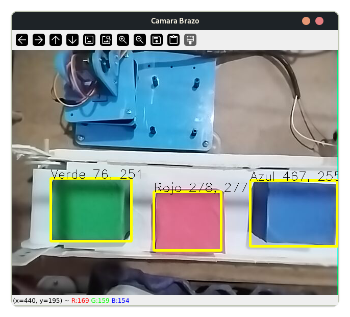
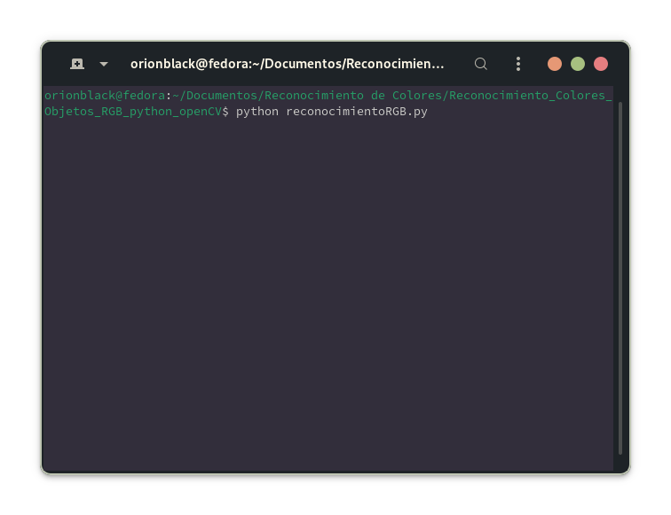

# Reconocimiento de color RGB y tracking de objetos usando openCV

El objetivo de este repositorio es almacenar el codigo de reconocimiento de colores en RGB para aplicaciones futuras de visión artificial con openCV y numpy. 
Este codigo es utilizado para la identificación de objetos rectangulares o cuadrados de color rojo, verde o azul sobre una imagen de 620 x 480 pero puede adaptarse fácilmente a otras resoluciones de imagen ademas de formas. 

    

## Características
- **Detección de limites de objeto encerrado en rectángulos**: Originalmente al detectar un objeto de color RGB que este dentro del limite de área especificado sera marcado con un rectángulo amarillo
- **Etiquetado**: Al detectarse un objeto RGB valido se etiquetara su color y se mostrara en formato *({Color} {coord X} {coord Y})*
- **Reconocimiento RGB**: Los limites bajos y altos (inferiores y superiores) marcados en el código permiten una amplia y precisa manera de reconocer los 3 colores RGB en diversas tonalidades de color y ajustes de luminosidad.
- **Tracking certero de objetos**: Una vez identificado el objeto RGB este se mantendrá constantemente marcado por un rectángulo amarillo que indicara en todo momento su posición
- **Muestreo de coordenadas X y Y sobre la imagen**: Al detectarse el objeto RGB valido se mostraran dos valores para las coordenadas *X* y *Y* respectivamente, estos valores son de manera relativa a las coordenadas del tamaño de imagen procesada. 

## Funcionamiento Interno

De manera general este código funciona siguiendo una serie de pasos:
- Abrir conexión o flujo de imágenes o video con <code>cv2.VideoCapture("URL o fuente de imagen o video")</code>
- Se cargan los limites bajos y altos de color para RGB
- Una vez abierto el flujo de datos de la camara o imagen se inicia la captura frame a frame del flujo de imagenes o video
- Se llama a la funcion <code>detectarColor()</code> con el frame actual, los colores RGB altos y bajos y el nombre de color especificado
    - Ejemplo: <code>detectarColor( frame, azulBajo, azulAlto, "Azul")</code>
- Si es un objeto valido dentro del margen de area establecido se encerrara el objeto con un rectangulo amarillo y se mostrara en una etiqueta el color del objeto
- Se mantiene el tracking del objeto hasta que el programa finalice

Se admiten multiples objetos RGB.

Este programa declara 2 funciones:
1. *def detectarColor()*
    En este método se recuperan 4 argumentos (frame, colorBajo, colorAlto, nombreColor), el primer parametro _frame_ recibe el frame actual del flujo de video generado por <code> cv2.VideoCapture() </code>, los siguientes dos argumentos toman los valores de limite alto y bajo de color para RGB y el ultimo parametro es el nombre del color. En esta función también se generan las mascaras de color, se detectan los contornos del objeto, sus coordenadas, ancho W, alto H, y posteriormente si es un objeto con una área dentro del margen establecido se coloca el rectángulo amarillo con la etiqueta del color identificado y se inicia el tracking del objeto. 
2. *def iniciar*
    Este método se llama para iniciar la captura de video o imagen y llama dentro de si a la función de detectarColor() y despliega en una ventana el video o imagen capturada con cv2 y procesada. 
    
Para ejecutar el programa desde la terminal usamos el comando <code>python reconocimientoRGB.py</code>

  

Éxito programador...

## Adicional

- Se requiere python 3 minimo
- Para este caso usamos una IP webcam

**Notas**: En caso de algun problema o sugerencia no dudes en contactarme

## Contacto

- **TikTok:** @hablemosdec0d3
- **LinkedIn:** https://www.linkedin.com/in/jesus-gonz%C3%A1lez-becerril-a55159244?utm_source=share&utm_campaign=share_via&utm_content=profile&utm_medium=android_app
- **Facebook:** https://www.facebook.com/share/2StcZSxmuFsK1u2N/?mibextid=qi2Omg
- **Gmail:** alexmartinizdominguez@gmail.com
